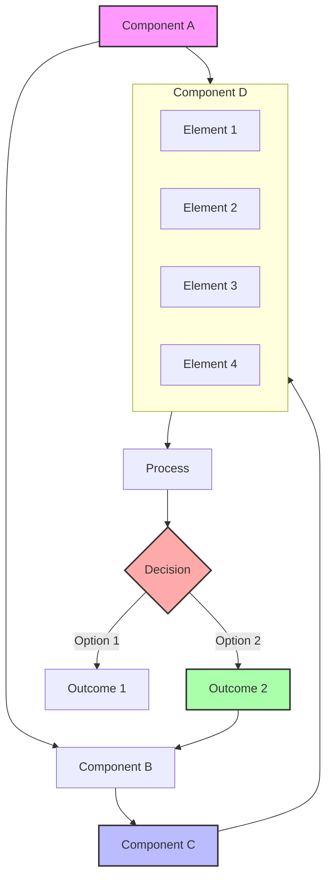
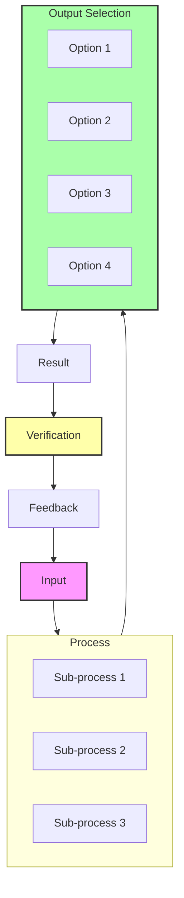
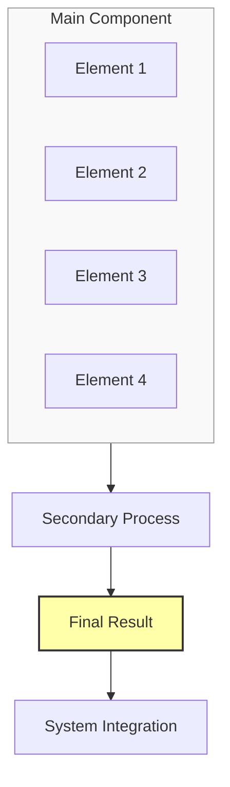

# [Title]

## Problem Statement
[Describe the problem this proposal addresses, its significance, and why current approaches are insufficient.]

## Proposed Approach

### 1. [First Key Component]
[Describe the first major component of your proposed solution]

### 2. [Second Key Component]
[Describe the second major component of your proposed solution]

### 3. [Third Key Component]
[Describe the third major component of your proposed solution]

## Detailed System Specifications

Each component of the [proposal name] is designed to address specific aspects of [core challenge]. Here we provide detailed specifications for each component.

### [First Component Name]

**Purpose:** [State the primary function of this component]

**Implementation Details:**
- **Architecture:** [Brief architectural overview]
- **[Process/Method Name]:**
  - [Key process step or aspect]
  - [Key process step or aspect]
  - [Key process step or aspect]
- **[Another Key Feature]:** [Description of this feature]
- **Key Components:**
  - [Component 1]
  - [Component 2]
  - [Component 3]
  - [Component 4]

**Expected Capabilities:** [Summary of what this component will achieve]

### [Second Component Name]

**Purpose:** [State the primary function of this component]

**Implementation Details:**
- **Architecture:** [Brief architectural overview]
- **[Feature/Aspect Types]:**
  - [Type 1 with brief description]
  - [Type 2 with brief description]
  - [Type 3 with brief description]
  - [Type 4 with brief description]
- **[Adaptation/Process Mechanism]:** [Mechanism] based on:
  - [Factor 1]
  - [Factor 2]
  - [Factor 3]
  - [Factor 4]
- **Key Components:**
  - [Component 1]
  - [Component 2]
  - [Component 3]
  - [Component 4]

**Expected Capabilities:** [Summary of what this component will achieve]

### [Third Component Name]

**Purpose:** [State the primary function of this component]

**Implementation Details:**
- **Architecture:** [Brief architectural overview]
- **[Type/Categories]:**
  - [Type 1]: [Brief description]
  - [Type 2]: [Brief description]
  - [Type 3]: [Brief description]
  - [Type 4]: [Brief description]
- **[Selection/Process Logic]:** [Logic/method] based on:
  - [Factor 1]
  - [Factor 2]
  - [Factor 3]
  - [Factor 4]
- **Key Components:**
  - [Component 1]
  - [Component 2]
  - [Component 3]
  - [Component 4]

**Expected Capabilities:** [Summary of what this component will achieve]

## Visual Representations

### Diagram 1: [Diagram Name]

### Diagram 2: [Diagram Name]

### Diagram 3: [Diagram Name]

## Implementation Plan

1. **Phase 1**: [Phase 1 Name]
   - [Task 1]
   - [Task 2]
   - [Task 3]
   - [Task 4]

2. **Phase 2**: [Phase 2 Name]
   - [Task 1]
   - [Task 2]
   - [Task 3]
   - [Task 4]

3. **Phase 3**: [Phase 3 Name]
   - [Task 1]
   - [Task 2]
   - [Task 3]
   - [Task 4]

4. **Phase 4**: [Phase 4 Name]
   - [Task 1]
   - [Task 2]
   - [Task 3]
   - [Task 4]

## Expected Outcomes

1. **[Outcome Category 1]**: [Description of this outcome]

2. **[Outcome Category 2]**: [Description of this outcome]

3. **[Outcome Category 3]**: [Description of this outcome]

4. **[Outcome Category 4]**: [Description of this outcome]

5. **Quantifiable Benefits**:
   - [Benefit 1]
   - [Benefit 2]
   - [Benefit 3]
   - [Benefit 4]

## Evaluation Framework

The effectiveness of the [proposal name] will be measured through:

1. **[Evaluation Category 1]**:
   - [Metric 1]
   - [Metric 2]
   - [Metric 3]
   - [Metric 4] 
