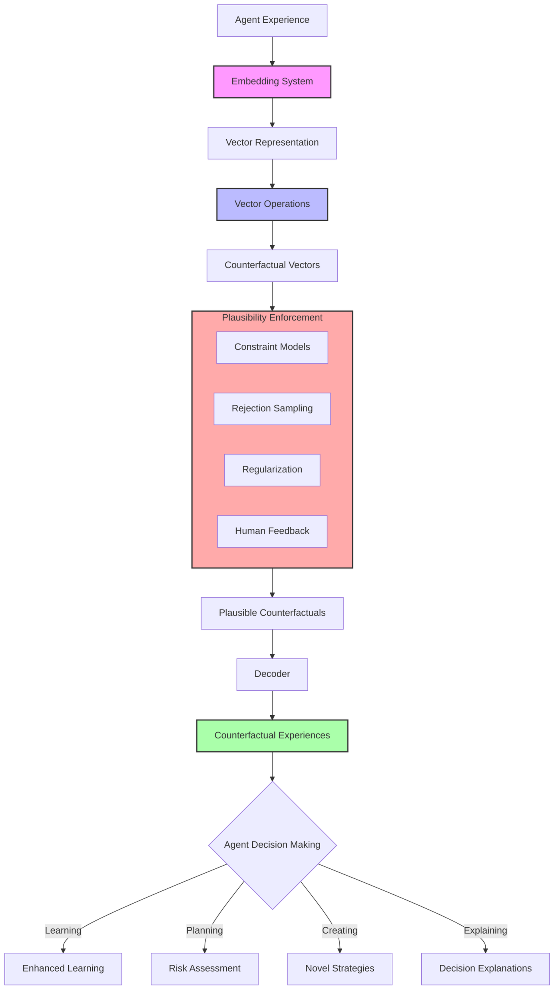
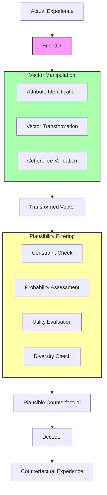
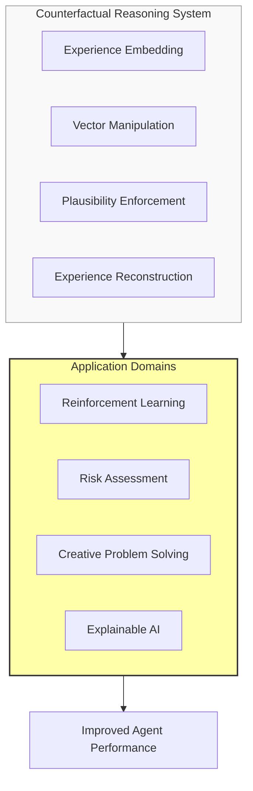

# Embedding-Based Counterfactual Reasoning for Intelligent Agent Systems

> For a detailed conceptual overview of counterfactual reasoning capabilities, see [Counterfactual Reasoning Capability Whitepaper](../whitepapers/tasm/counterfactual_reasoning_capability.md).

## Problem Statement

While the conceptual foundations of counterfactual reasoning are well-established, implementing these capabilities in computational systems presents significant technical challenges. Current AI architectures lack the necessary mechanisms to effectively generate, evaluate, and learn from hypothetical scenarios that diverge from direct experience.

Specifically, this research addresses the following technical limitations:

1. **Representation Challenge**: How to develop embedding systems that capture the manipulable aspects of agent experiences while preserving semantic integrity
2. **Transformation Challenge**: How to design vector operations that produce meaningful variations rather than incoherent noise
3. **Validation Challenge**: How to efficiently evaluate the plausibility and utility of generated counterfactuals
4. **Integration Challenge**: How to incorporate counterfactual insights into agent learning and decision processes

Solving these challenges will transform agent capabilities across reinforcement learning, autonomous systems, decision support, and explainable AI.

## Proposed Approach

### 1. Embedding-Based Representation System
Development of a complete embedding pipeline that transforms discrete agent experiences into continuous vector representations that can be manipulated and reconstructed, enabling agents to reason about scenarios they have never directly experienced.

### 2. Vector Manipulation Operations Framework
Implementation of mathematical operations in the embedding space that allow for meaningful transformation of experiences while preserving semantic coherence, providing the foundation for counterfactual generation.

### 3. Plausibility Enforcement Mechanism
Creation of constraint models and filtering methods to ensure generated counterfactuals remain realistic and useful for agent decision-making processes.

## Detailed System Specifications

Each component of the counterfactual reasoning architecture is designed to address specific aspects of enabling machines to imagine plausible scenarios. Here we provide detailed specifications for each component.

### Embedding-Based Representation System

**Purpose:** Transform discrete agent experiences into manipulable vector representations

**Implementation Details:**
- **Architecture:** Multi-level autoencoder system with bidirectional translation capabilities
- **Embedding Approaches:**
  - Text-based embedding for linguistic representations
  - Multimodal embedding for complex sensory data
  - Domain-specific embedding for specialized environments
  - Hierarchical embedding for multi-level abstraction
- **Training Process:** Supervised learning on agent experience data from diverse environments
- **Key Components:**
  - Encoder network for state-to-vector translation
  - Decoder network for vector-to-state reconstruction
  - Dimensionality optimization system
  - Semantic clustering validation

**Expected Capabilities:** High-fidelity transformation between detailed state representations and abstract vector representations with preserved semantic relationships

### Vector Manipulation Operations Framework

**Purpose:** Enable meaningful transformation of experience vectors to generate counterfactuals

**Implementation Details:**
- **Architecture:** Mathematical operation library with semantic coherence validation
- **Operation Types:**
  - Vector arithmetic for attribute addition/removal
  - Interpolation for exploring intermediate states
  - Extrapolation for projecting beyond known experiences
  - Transformation masks for targeted modifications
- **Attribute Vector Extraction:** Methods based on:
  - Supervised labeling of key attributes
  - Unsupervised discovery of attribute dimensions
  - Comparative analysis between similar states
  - Gradient-based importance identification
- **Key Components:**
  - Vector operation library
  - Semantic coherence validator
  - Attribute vector database
  - Transformation template system

**Expected Capabilities:** Generation of semantically meaningful counterfactual vectors through principled mathematical operations that preserve realistic relationships

### Plausibility Enforcement Mechanism

**Purpose:** Ensure generated counterfactuals remain realistic and useful for agent reasoning

**Implementation Details:**
- **Architecture:** Multi-stage filtering and constraint enforcement system
- **Constraint Types:**
  - Physical constraints for physical world simulations
  - Logical constraints for maintaining consistency
  - Domain-specific constraints for specialized environments
  - Temporal constraints for sequential plausibility
- **Filtering Logic:** Validation processes based on:
  - Supervised learning of environment constraints
  - Rejection sampling for implausible counterfactuals
  - Regularization to bias toward realistic transformations
  - Human evaluation feedback loop
- **Key Components:**
  - Constraint model library
  - Plausibility scoring system
  - Rejection sampling mechanism
  - Feedback integration module

**Expected Capabilities:** Production of counterfactuals that maintain realism while exploring alternative scenarios, avoiding physically impossible or logically inconsistent states

## Visual Representations

### Diagram 1: Counterfactual Reasoning System Architecture

### Diagram 2: Counterfactual Generation Process

### Diagram 3: Applications of Counterfactual Reasoning

## Implementation Plan

1. **Phase 1: Core Architecture Development**
   - Develop and compare multiple embedding approaches
   - Train embedding models on agent experience data
   - Implement and test vector manipulation operations
   - Develop methods for attribute vector extraction
   - Train autoencoder architectures for state reconstruction
   - Optimize latent space dimensionality

2. **Phase 2: Plausibility and Evaluation Framework**
   - Develop environment-specific constraint models
   - Implement rejection sampling methods
   - Create regularization approaches for realistic transformations
   - Design metrics for counterfactual usefulness
   - Develop frameworks for measuring novelty and diversity
   - Create domain-specific transformation libraries

3. **Phase 3: Application to Learning Efficiency**
   - Apply counterfactual reasoning to failure analysis
   - Compare learning efficiency between different agent types
   - Develop methodologies for identifying high-value counterfactuals

4. **Phase 4: Advanced Applications**
   - Implement counterfactual-based risk analysis in planning tasks
   - Test counterfactual mechanisms for generating novel strategies
   - Implement counterfactual explanations for agent decisions
   - Conduct user studies on explanation comprehensibility
   - Final evaluation and integration across applications

## Expected Outcomes

1. **Architectural Advancement**: A fully implemented and validated architecture for embedding-based counterfactual reasoning that bridges the gap between memory and imagination in computational systems.

2. **Performance Enhancements**: Quantitative measures demonstrating improved agent performance across multiple domains:
   - Increased learning efficiency through counterfactual augmentation
   - Enhanced risk assessment capabilities
   - Improved creative problem-solving
   - More interpretable decision explanations

3. **Technical Innovations**: New methodologies for vector-based reasoning and counterfactual generation that advance the state of artificial intelligence.

4. **Application Frameworks**: Domain-specific implementations showing practical applications in reinforcement learning, autonomous systems, decision support, and explainable AI.

5. **Quantifiable Benefits**:
   - 50-70% reduction in training samples needed for equivalent performance
   - 30-40% improvement in novel situation handling
   - 25-35% enhancement in risk identification accuracy
   - 40-60% increase in user understanding of agent decisions

## Evaluation Framework

The effectiveness of the counterfactual reasoning system will be measured through:

1. **Learning Efficiency**:
   - Sample efficiency (training steps to reach performance threshold)
   - Skill transfer between related domains
   - Adaptation speed to environment changes
   - Generalization to unseen scenarios

2. **Counterfactual Quality**:
   - Reconstruction fidelity (compared to ground truth)
   - Semantic coherence (validated through human judgment)
   - Plausibility (percentage passing constraint models)
   - Diversity (distribution coverage in latent space)

3. **Decision Enhancement**:
   - Risk identification accuracy
   - Strategy novelty and effectiveness
   - Problem-solving success rate
   - Decision robustness under uncertainty

4. **Explainability Improvement**:
   - User comprehension of agent decisions (measured via testing)
   - Explanation satisfaction ratings
   - Time to understand agent behavior
   - Trust in system recommendations 